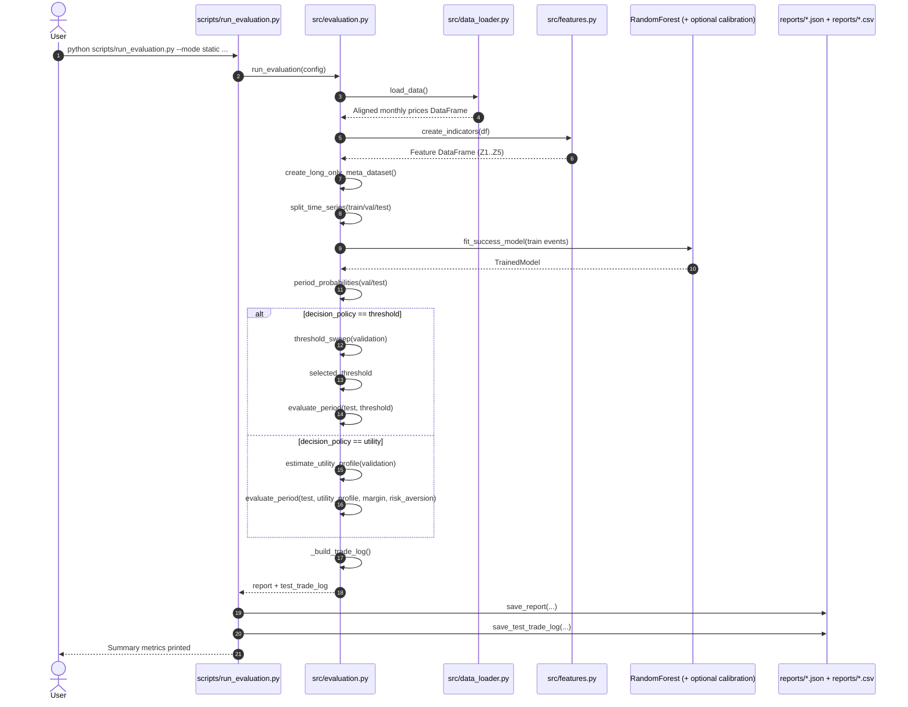
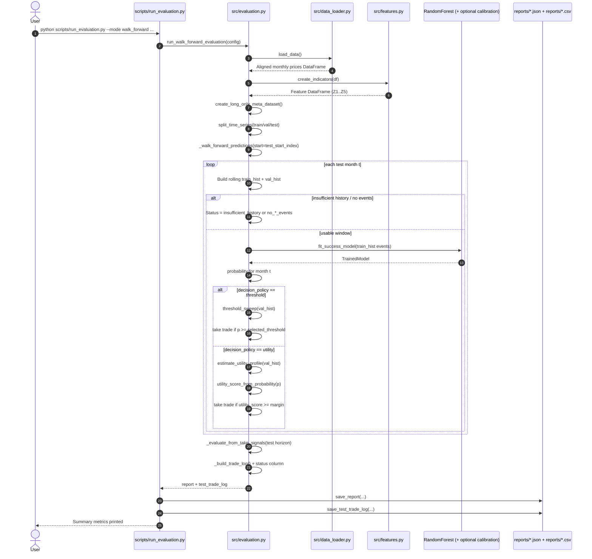
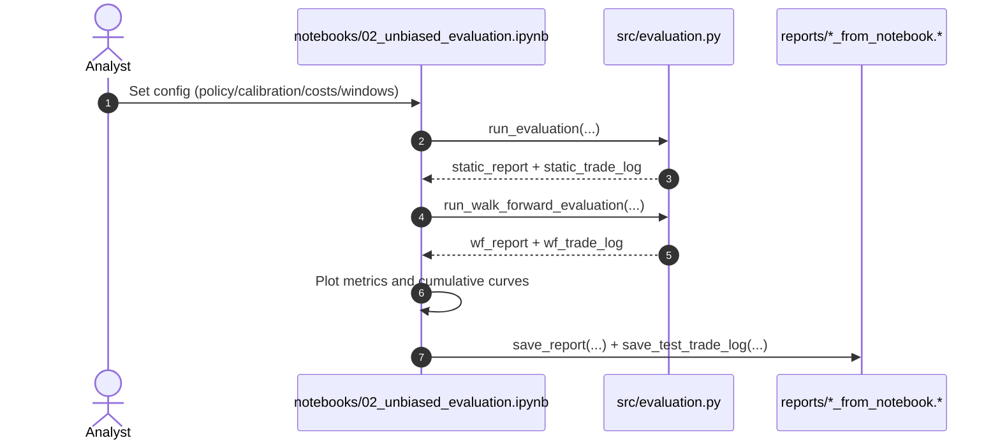

# Execution Sequence Diagrams

This document provides sequence-style diagrams for the two main evaluation paths:
- `static` mode
- `walk_forward` mode

It also highlights where `threshold` and `utility` decision policies diverge.

## 1) Static Evaluation Sequence

## 2) Walk-Forward Evaluation Sequence

## 3) Notebook Path (`notebooks/02_unbiased_evaluation.ipynb`)

## 4) Practical Interpretation

- `static` mode calibrates once, then evaluates once on held-out test.
- `walk_forward` mode recalibrates repeatedly before each test month.
- `threshold` policy is probability gating.
- `utility` policy is expected-value gating with explicit cost and uncertainty penalty controls.

